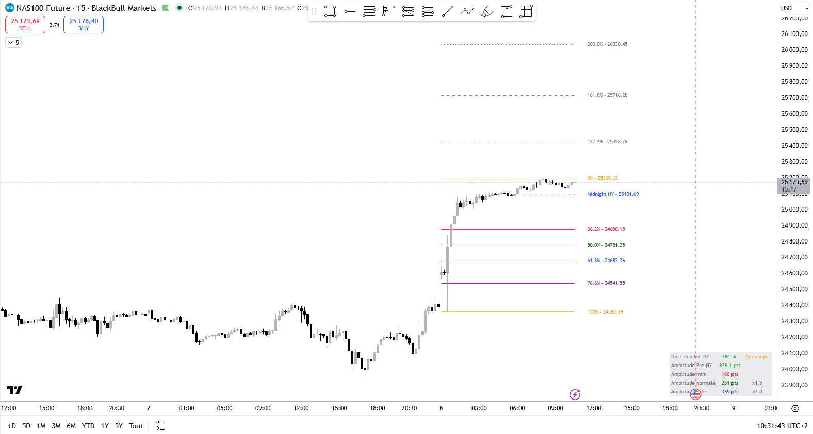

# JCO NY Amplitude Levels

Indicateur TradingView Pine Script v6 pour le scalp contrarien sur NQ Futures (Nasdaq 100).

Il trace les niveaux de Fibonacci basés sur le range Pre-NY (ouverture CME Globex → ouverture NY AM), avec dashboard d'amplitude intégré.

---

## Principe

Chaque nuit, le NQ trace un range entre l'ouverture de la session CME Globex (22h UTC) et l'ouverture de la session NY AM (15h30 Paris par défaut). Ce range Pre-NY constitue la base de tous les niveaux Fibonacci.

- **Avant 15h30 Paris** : les niveaux sont **dynamiques** — ils suivent le High/Low en temps réel
- **A partir de 15h30** : les niveaux sont **figés** — snapshot complet du range Pre-NY
- **Visible à partir de 7h Paris** pour préparer la session

L'ordre chronologique des extrêmes (High avant Low ou Low avant High) détermine la direction et l'orientation du Fibonacci.

---

## Niveaux tracés

### Retracements (contre-tendance)

| Niveau | Couleur par défaut | Description                                    |
|--------|--------------------|------------------------------------------------|
| 0%     | Orange             | Extrémité récente (départ des retracements)    |
| 38.2%  | Rouge              | Premier retracement                            |
| 50.0%  | Vert foncé         | Retracement médian                             |
| 61.8%  | Bleu               | OTE+ (Optimal Trade Entry)                     |
| 78.6%  | Violet             | OTE-                                           |
| 100%   | Orange             | Extrémité ancienne (retracement complet)       |

### Extensions (continuation de tendance)

| Niveau  | Couleur par défaut | Style par défaut |
|---------|--------------------|------------------|
| 127.2%  | Gris               | Tirets           |
| 161.8%  | Gris               | Tirets           |
| 200.0%  | Gris               | Pointillés       |

---

## Midnight NY Open

Ligne horizontale au prix d'ouverture de la barre 0h00 NY (configurable). Utile comme référence de gap overnight.

- Timezone configurable (New York, Paris, Londres, Tokyo, etc.)
- Heure et minute configurables
- Style, couleur et épaisseur configurables

---

## Dashboard

Affiché en bas à droite du graphique :

| Ligne             | Valeur                           | Description                           |
|-------------------|----------------------------------|---------------------------------------|
| Direction Pre-NY  | UP / DOWN + Dynamique/Fige       | Direction du range et etat            |
| Amplitude Pre-NY  | ex. 838 pts                      | Range total High-Low                  |
| Amplitude mini    | ex. 168 pts                      | Range / 5 (moyenne des 5 intervalles) |
| Amplitude normale | ex. 251 pts (x1.5)               | Amplitude mini x 1.5                  |
| Amplitude safe    | ex. 335 pts (x2.0)               | Amplitude mini x 2.0                  |

---

## Paramètres

### Session NY AM

- **Heure debut NY AM (Paris)** : heure d'ouverture NY en heure de Paris (défaut : 15)
- **Minute debut NY AM** : minute (défaut : 30)

### Dashboard

- **Afficher le dashboard** : afficher/masquer le dashboard

### Retracements

Chaque niveau (0%, 100%, 38.2%, 50%, 61.8%, 78.6%) est configurable indépendamment :

- Afficher/masquer
- Couleur
- Épaisseur (1–4)
- Style (solid / dashed / dotted)

### Extensions

Chaque niveau (127.2%, 161.8%, 200%) est configurable indépendamment.

### Midnight NY Open

- Afficher/masquer la ligne
- Couleur, épaisseur, style
- Timezone (New York, Chicago, Los Angeles, London, Paris, Berlin, Tokyo, Hong Kong, Sydney, UTC)
- Heure (0–23) et Minute (0–59)

---

## Installation

1. Ouvrir TradingView → Pine Script Editor
2. Coller le contenu de `Indicator_JCO_NY_Amplitude_Levels.pine`
3. Cliquer sur **Ajouter au graphique**
4. Appliquer sur un graphique NQ Futures (CME) en timeframe 1m à 15m

---

## Compatibilité

- **Symbole recommandé** : NQ1! / MNQ1! (CME Globex)
- **Timeframes recommandés** : 1m, 2m, 5m, 15m
- **Pine Script** : v6

---

## Licence

[Mozilla Public License 2.0](https://mozilla.org/MPL/2.0/)

© jcornier — [GitHub](https://github.com/jcornierfra/TradingView_Indicator_JCO_NY_Amplitude_Levels)
