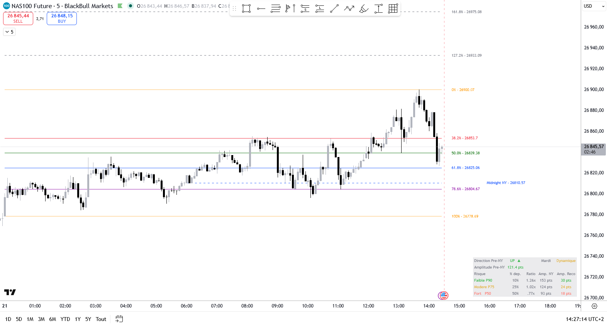
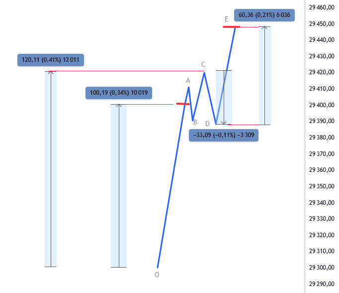

# JCO NY Amplitude Levels



Indicateur TradingView Pine Script v6 pour le scalp contrarien sur NQ Futures (Nasdaq 100).

Il trace les niveaux de Fibonacci basés sur le range Pre-NY (ouverture CME Globex → ouverture NY AM), avec dashboard d'amplitude intégré incluant une recommandation d'amplitude par niveau de risque basée sur les statistiques NQ 2024–2026.

---

## Principe

Chaque nuit, le NQ trace un range entre l'ouverture de la session CME Globex (22h UTC) et l'ouverture de la session NY AM (15h30 Paris par défaut). Ce range Pre-NY constitue la base des niveaux Fibonacci affichés en pré-session.

L'indicateur fonctionne en **deux modes** :

- **Mode Pre-NY (avant 15h30 Paris)** : les niveaux Fibonacci sont **dynamiques** — ils suivent le High/Low du Pre-NY en temps réel, visibles à partir de 7h Paris pour préparer la session.
- **Mode Post-NY (à partir de 15h30)** : les niveaux Fibo disparaissent et sont remplacés par 3 lignes horizontales tracées sur la **journée TradingView complète** :
  - Day High (orange)
  - Day Low (orange)
  - Day 50% (vert) — milieu du range du jour

Les Day High/Low sont mis à jour en temps réel pendant la session NY si de nouveaux extrêmes sont atteints.

L'ordre chronologique des extrêmes (High avant Low ou Low avant High) détermine la direction et l'orientation du Fibonacci en mode Pre-NY.

---

## Niveaux tracés (Mode Pre-NY)

### Retracements (contre-tendance)

| Niveau | Couleur par défaut | Description                                    |
|--------|--------------------|------------------------------------------------|
| 0%     | Orange             | Extrémité récente (départ des retracements)    |
| 38.2%  | Rouge              | Premier retracement                            |
| 50.0%  | Vert foncé         | Retracement médian                             |
| 61.8%  | Bleu               | OTE+ (Optimal Trade Entry)                     |
| 78.6%  | Violet             | OTE-                                           |
| 100%   | Orange             | Extrémité ancienne (retracement complet)       |

### Extensions sous 0% (continuation tendance Pre-NY)

| Niveau | Couleur par défaut | Style par défaut | Position (DOWN)                   |
|--------|--------------------|------------------|-----------------------------------|
| -27.2% | Gris               | Tirets           | Low − 0.272 × range (sous le Low) |
| -61.8% | Gris               | Tirets           | Low − 0.618 × range               |
| -100%  | Gris               | Pointillés       | Low − 1.000 × range               |

### Extensions au-dessus de 100% (cassure contre Pre-NY)

| Niveau | Couleur par défaut | Style par défaut | Position (DOWN)                          |
|--------|--------------------|------------------|------------------------------------------|
| 127.2% | Gris               | Tirets           | High + 0.272 × range (au-dessus du High) |
| 161.8% | Gris               | Tirets           | High + 0.618 × range                     |
| 200.0% | Gris               | Pointillés       | High + 1.000 × range                     |

L'échelle de pourcentage est mathématiquement cohérente : 0% = extrême récent, 100% = extrême ancien, valeurs négatives sous 0%, valeurs > 100% au-dessus.

---

## Niveaux tracés (Mode Post-NY)

À partir de 15h30 Paris, ces 3 lignes remplacent les Fibo et restent visibles jusqu'à la fin de la session NY PM :

| Ligne     | Couleur par défaut | Description                                       |
|-----------|--------------------|---------------------------------------------------|
| Day High  | Orange             | Plus haut de la journée TradingView complète      |
| Day Low   | Orange             | Plus bas de la journée TradingView complète       |
| Day 50%   | Vert foncé         | Milieu du range du jour : (High + Low) / 2        |

---

## Midnight NY Open

Ligne horizontale au prix d'ouverture de la barre 0h00 NY (configurable). Utile comme référence de gap overnight.

- Timezone configurable (New York, Paris, Londres, Tokyo, etc.)
- Heure et minute configurables
- Style, couleur et épaisseur configurables

---

## Marques d'amplitude (greffon)

Greffon intégré (port de l'indicateur **JCO Amplitude v2.2.0**) qui pose automatiquement des marques sur le graphique quand le prix parcourt une amplitude définie. Utile pour identifier visuellement des points contrariens (sortie d'un mouvement) ou des continuations.



### Principe du greffon

Mécanique à deux phases avec **dissociation Long / Short** des amplitudes depuis v1.19 (4 valeurs au lieu de 2) :

- `A1L` / `A1S` — amplitude 1 (reversal) pour Long (marque verte) / Short (marque rouge)
- `A2L` / `A2S` — amplitude 2 (continuation) pour Long / Short

**Phase 1 — Searching (1ère marque du jour)**
Détection du dernier swing valide (selon `Swing left bars` / `Swing right bars`). Les deux directions sont armées en parallèle :

- `bullTrigger = swingLow + A1S` (signal vente / marque rouge → futur trade short)
- `bearTrigger = swingHigh - A1L` (signal achat / marque verte → futur trade long)

Le premier des deux atteint pose une marque et passe en phase 2.

**Phase 2 — Tracking (cycle après la 1ère marque)**
Deux règles évaluées par priorité :

1. **Reversal** (seuil = `A1` de la **nouvelle direction**) : si le prix retrace d'au moins `A1L` (resp. `A1S`) depuis l'extrême atteint, marque posée de couleur opposée, direction inversée.
2. **Continuation** (path-driven, `A1` ou `A2` de la **direction en cours**) : si le prix repart dans le sens de la tendance, marque posée à l'extrême opposé + `A_path`.

Le path (A1 vs A2) est ré-évalué uniquement quand l'extrême opposé fait un nouveau plus bas (ou plus haut). Si le retracement dépasse 30% du mouvement total depuis l'origine → `A1` (pleine amplitude), sinon `A2` (continuation réduite).

### Code couleur (lecture contrarienne)

| Mouvement  | Couleur | Signal       |
|------------|---------|--------------|
| Bas → Haut | Rouge   | Signal vente |
| Haut → Bas | Vert    | Signal achat |

### Spécificités techniques

- **Force la timeframe M1** quelle que soit la TF du chart, via `request.security_lower_tf()`. Permet d'utiliser un chart M5, M15, H1 pour le contexte tout en gardant la finesse de déclenchement M1.
- **3 sessions horaires** contiguës (London / NY AM / NY PM) couvrent la fenêtre 8h–22h par défaut, avec un jeu de 4 coefficients Auto NY indépendant par session. Hors fenêtre (22h–8h) : aucune marque tracée.
- **Timezone configurable** (mêmes options que la ligne Midnight NY ; défaut : Paris) — pilote l'interprétation des horaires de session ET le reset journalier.
- **Reset journalier** à minuit dans la timezone choisie. Reset par session optionnel (3 toggles distincts, tous cochés par défaut).
- Toggle `Afficher les marques` pour activer/désactiver le greffon (case à cocher en tête du groupe).

### Sessions horaires (v1.20)

3 sessions contiguës qui couvrent la journée de trading. Chaque session a sa propre plage horaire et son propre jeu de 4 coefficients Auto NY :

| Session    | Plage (par défaut, Paris) | A1L   | A1S   | A2L   | A2S   |
|------------|---------------------------|-------|-------|-------|-------|
| **London** | 8h00 → 15h30              | 0.175 | 0.175 | 0.250 | 0.275 |
| **NY AM**  | 15h30 → 18h30             | 0.390 | 0.330 | 0.420 | 0.255 |
| **NY PM**  | 18h30 → 22h00             | 0.325 | 0.225 | 0.400 | 0.300 |

**Bornes implicites** : la fin d'une session est le début de la suivante (pas de gap possible). Modifier `Heure debut NY AM` change donc la fin de London. Modifier `Heure debut NY PM` change la fin de NY AM. Seules London (début) et NY PM (fin) ont des bornes explicites.

**Sélection automatique** : à chaque M1 traitée, le greffon détermine la session courante en fonction de l'heure locale et applique les 4 amplitudes correspondantes. La state machine continue 24h/24 — seuls le DESSIN des marques (gate `inWindow`) et le choix des amplitudes dépendent de la session.

### Auto NY (v1.11, par session depuis v1.20)

Case à cocher **Auto NY** (activée par défaut depuis v1.12) : les 4 amplitudes du greffon sont calculées depuis l'historique NY récent via la moyenne lissée `avg_reco` et les **4 coefficients de la session courante** :

```text
A1L_session = round(coef_A1L_session × avg_reco)
A1S_session = round(coef_A1S_session × avg_reco)
A2L_session = round(coef_A2L_session × avg_reco)
A2S_session = round(coef_A2S_session × avg_reco)
```

Les 12 coefficients (3 sessions × 4 amplitudes) sont configurables dans les groupes **Session London**, **Session NY AM** et **Session NY PM**. Pratique pour adapter le greffon à la volatilité spécifique de chaque période de la journée (London plus calme, NY AM le plus volatil sur NQ, NY PM intermédiaire).

**Auto NY décoché** : les 4 inputs manuels A1L / A1S / A2L / A2S s'appliquent aux 3 sessions (mêmes valeurs partout). Pour des amplitudes différentes par session en mode manuel, cocher Auto NY.

### Restart par session (v1.12, par session depuis v1.20)

3 cases à cocher distinctes — `Restart recherche Amp1 au debut de London / NY AM / NY PM` — toutes **cochées par défaut**. Chaque toggle relance la phase `searching` à l'ouverture de la session correspondante, ce qui permet de poser une nouvelle marque Amp1 fraîche à chaque transition (avec les nouveaux coefs de la session).

Les **swings high/low** détectés juste avant l'ouverture sont **conservés** comme référence. Un mouvement amorcé juste avant l'open continue donc de compter dans le calcul Amp1.

Exemple : à 15h29 une bougie haussière de 30 pts forme un swing low à X. À 15h30, l'open NY AM réinitialise la phase à `searching` (swing low toujours = X) et bascule sur les coefs NY AM. Si la bougie d'open monte de 80 pts (high atteint X+110), le trigger `swing + A1S NY AM (calculé via 0.330 × avg_reco)` est atteint → marque rouge posée.

Sans la case de la session courante cochée, la state machine tourne en continu : si elle était déjà en phase tracking avant l'ouverture, elle reste en tracking et pose des marques de continuation/reversal selon la logique habituelle (avec les nouveaux coefs de la session active).

### Paramètres principaux

- **A1L** / **A1S** / **A2L** / **A2S** (défauts : **120 / 100 / 127 / 77** pts) — inputs manuels appliqués aux 3 sessions si Auto NY est décoché ; ignorés sinon.
- **Auto NY** (défaut : **coché**) — calcule les 12 amplitudes (4 par session) via les coefficients par session × `avg_reco`.
- **Prix par point** (défaut : 1.0 pour NQ/MNQ/ES)
- **Méthode détection swing** (défaut : `Durée` depuis v1.15) — choix entre :
  - `Bougies` : pivot défini par **Swing left/right bars** (défaut 3/3, pivot strict sur 7 bougies M1)
  - `Durée` : pivot défini par **Durée avant/après** en minutes (défaut 15/15, **Durée après peut valoir 0** depuis v1.16 pour détection temps réel) — indépendant de la TF du chart, utile sur les charts sub-minute
- **Timezone des sessions** (défaut : Paris) — applique à toutes les bornes horaires (London/NY AM/NY PM) et au reset journalier.
- **Largeur marque** (défaut : 2 bars), **épaisseur trait**, **couleurs bull/bear** — personnalisation visuelle

---

## Dashboard

Affiché en bas à droite du graphique, **3 colonnes × 9 lignes** :

| Ligne | Colonne 0 (label)            | Colonne 1 (Long / vert)      | Colonne 2 (Short / rouge)  |
|-------|------------------------------|------------------------------|----------------------------|
| 0     | UP ▲ / DOWN ▼                | —                            | Figé / Dynamique           |
| 1     | « Amp. Pre-NY »              | Valeur Pre-NY (ex. 121 pts)  | —                          |
| 2     | « Amp. Moy. Nd »             | Valeur moy. Nd (ex. 215 pts) | —                          |
| 3     | « Amp. NY min/max »          | P50 (mini, rouge)            | P90 (maxi, vert)           |
| 4     | « Amp. Reco - {SES} »        | « Long » (header vert)       | « Short » (header rouge)   |
| 5     | « A1 »                       | A1L de la session (vert)     | A1S de la session (rouge)  |
| 6     | « A2 »                       | A2L de la session (vert)     | A2S de la session (rouge)  |
| 7     | Auto (vert) / Manuel (orange)| « No-Go » (header gris)      | « Solder » (header gris)   |
| 8     | « Filtre efficience »        | Valeur No-Go (gris/rouge)    | Valeur Solder (gris/rouge) |

- **Lignes 0-3** : direction Pre-NY, amplitude du jour, moyenne historique, estimations NY.
- **Ligne 4** : `{SES}` = raccourci 3 caractères de la **session courante** (`LON` / `NYA` / `NYP` / `HS`). Change automatiquement à chaque transition de session (15h30, 18h30, 22h00 par défaut).
- **Lignes 5-6** : amplitudes recommandées de la session courante (dissociées Long / Short depuis v1.19, par session depuis v1.20).
- **Ligne 7 col 0** : source des amplitudes — `Auto` (vert) si Auto NY coché, `Manuel` (orange) sinon. Le reste de la ligne porte le header No-Go / Solder.
- **Lignes 7-8** : filtre efficience Kaufman (v1.19). Valeur **live** avant l'heure gate, **figée** ensuite. Couleur **rouge** dès que la valeur ≥ seuil configuré, **gris** sinon.

Le dashboard se masque entièrement avec le toggle `Afficher le dashboard` (groupe **Dashboard**).

---

### Méthode de calcul de l'Amp. Reco (v1.9)

L'objectif est d'obtenir une amplitude recommandée **stable et raisonnable** pour le scalping, qui ne s'envole pas brutalement après une journée explosive (les fins de journée sont rarement aussi extrêmes que les débuts).

**Étapes du calcul** :

1. **Suivi automatique des amplitudes NY récentes** : à chaque session NY (15h30 → 22h Paris), l'indicateur calcule `Amp NY = High - Low` et stocke la valeur dans un historique glissant des N derniers jours de trading (N configurable, défaut **5**).

2. **Estimation NY pour aujourd'hui** : on prend la plus grande estimation statistique, soit **Amp. NY P90** (ratio P90 du jour × Amp. Pre-NY), correspondant au risque faible.

3. **Moyenne lissée** (diviseur ajusté en v1.18) :

   ```text
   avg = (Amp. NY P90 + somme des amplitudes NY chargées) / (nb_jours_chargés + 1)
   ```

   Le diviseur utilise le nombre **réel** de jours présents dans l'historique (au plus N), pas N figé. Évite la sous-estimation en phase de warmup.

4. **Quatre Amp. Reco** (dissociation L/S v1.19) avec **4 coefficients distincts** :

   ```text
   A1L = round(0.390 × avg)   # Long Amp1 (reversal long)
   A1S = round(0.330 × avg)   # Short Amp1 (reversal short)
   A2L = round(0.420 × avg)   # Long Amp2 (continuation long)
   A2S = round(0.255 × avg)   # Short Amp2 (continuation short)
   ```

**Pourquoi cette méthode ?**

- **Lissage** : la somme des N derniers jours intègre la dynamique récente du marché et amortit les valeurs extrêmes.
- **Cohérence avec les statistiques** : l'estimation P90 (Amp. NY maxi) sert d'ancrage statistique haut.
- **Dissociation Long / Short** (v1.19) : sur NQ, le côté short est statistiquement plus volatil que le côté long — les 4 coefs permettent de coller à cette asymétrie sans ressaisir les valeurs chaque jour.

Les ratios statistiques par jour de la semaine sont issus de l'analyse historique NQ (2 jan. 2024 – 2 avr. 2026, 581 jours de trading).

---

## Paramètres

### Session NY AM

- **Heure debut NY AM (Paris)** : heure d'ouverture NY en heure de Paris (défaut : 15)
- **Minute debut NY AM** : minute (défaut : 30)

### Paramètres Dashboard

- **Afficher le dashboard** : toggle bool (défaut **coché**) — affiche / masque le dashboard.

### Calcul Amp. Reco

Configurable depuis le groupe **"Calcul Amp. Reco"** :

- **Nb jours pour la somme** (défaut **5**) : nombre N de sessions NY précédentes utilisées dans la moyenne. Le diviseur utilise la taille réelle de l'historique + 1 (les jours chargés + l'estimation P90 du jour).
- **Coef A1L (Long Amp1)** (défaut **0.390**)
- **Coef A1S (Short Amp1)** (défaut **0.330**)
- **Coef A2L (Long Amp2)** (défaut **0.420**)
- **Coef A2S (Short Amp2)** (défaut **0.255**)

Chaque coefficient est appliqué directement à la moyenne `avg_reco` pour donner la valeur correspondante en points.

### Niveaux (toggle maître)

- **Afficher toutes les lignes** : case à cocher unique qui masque/affiche d'un coup **toutes** les lignes des niveaux (les 6 retracements, les 6 extensions, et les 3 Day lines Post-NY). La ligne Midnight NY garde son toggle indépendant.

### Retracements

Chaque niveau (0%, 100%, 38.2%, 50%, 61.8%, 78.6%) est configurable indépendamment :

- Afficher/masquer
- Couleur
- Épaisseur (1–4)
- Style (solid / dashed / dotted)

### Extensions

**Toggles maîtres** (en haut du groupe) :

- **Afficher extensions sous 0%** : masque/affiche d'un coup les 3 lignes -27.2% / -61.8% / -100%
- **Afficher extensions au-dessus 100%** : masque/affiche d'un coup les 3 lignes 127.2% / 161.8% / 200%

Chaque niveau individuel reste configurable indépendamment (afficher, couleur, épaisseur, style).

### Mode Post-NY

Chaque ligne (Day High, Day Low, Day 50%) est configurable indépendamment :

- Afficher/masquer
- Couleur, épaisseur, style

### Paramètres Midnight NY Open

- Afficher/masquer la ligne
- Couleur, épaisseur, style
- Timezone (New York, Chicago, Los Angeles, London, Paris, Berlin, Tokyo, Hong Kong, Sydney, UTC)
- Heure (0–23) et Minute (0–59)

### Paramètres greffon Marques d'amplitude

- **Afficher les marques** : toggle global du greffon
- **Auto NY** (défaut **coché** depuis v1.12) : surcharge les 4 amplitudes L/S avec les Amp. Reco du dashboard
- **A1L** / **A1S** / **A2L** / **A2S** (défauts **120 / 100 / 127 / 77** pts depuis v1.19) — ignorés si Auto NY est coché
- **Ajuster les amplitudes avant NY AM** (défaut **coché** depuis v1.12) + **Coef pre-NY AM** (défaut 0.5)
- **Restart recherche Amp1 à chaque session** (défaut décoché) — relance une recherche fraîche au début de la fenêtre et à l'open NY AM
- **Prix par point** : 1.0 pour NQ/MNQ/ES
- **Méthode détection swing** (défaut **`Durée`** depuis v1.15) + paramètres associés :
  - Mode `Bougies` : **Swing left/right bars** (défaut **3/3** depuis v1.13)
  - Mode `Durée` : **Durée avant/après** en minutes (défaut **15/15**, nouveau v1.14 ; **Durée après ∈ [0, 120]** depuis v1.16 — 0 = pivot temps réel sur la bougie courante)
- **Fenêtre horaire** : début/fin (défaut 7h–22h) + **Timezone** (mêmes options que Midnight NY, défaut Paris)
- **Largeur marque** (défaut 2 bars), **épaisseur trait, couleurs bull/bear**

### Paramètres Efficience NY (v1.19)

Configurable depuis le groupe **"Efficience NY"** :

- **Activer le filtre d'efficience** (défaut **coché**) — active le calcul, le dashboard et les 2 alertes.
- **Seuil No-Go** (défaut **0.55**) — au-dessus de ce seuil à l'heure No-Go, le marché est jugé trop directionnel pour une entrée contrarienne.
- **Seuil Solder** (défaut **0.40**) — au-dessus de ce seuil à l'heure Solder, envisager de solder une position contrarienne ouverte.
- **Heure No-Go** / **Minute** (défaut **15h45** Paris)
- **Heure Solder** / **Minute** (défaut **16h15** Paris)

Les 2 alertes (`Efficience NO-GO` et `Efficience SOLDER`) se configurent via le menu **Add alert → Condition → JCO NY Amplitude Levels → [nom de l'alerte]** dans TradingView. Une seule émission par jour par alerte.

---

## Installation

1. Ouvrir TradingView → Pine Script Editor
2. Coller le contenu de `Indicator_JCO_NY_Amplitude_Levels.pine`
3. Cliquer sur **Ajouter au graphique**
4. Appliquer sur un graphique NQ Futures (CME) en timeframe 1m à 15m

---

## Compatibilité

- **Symbole recommandé** : NQ1! / MNQ1! (CME Globex)
- **Timeframes recommandés** : 1m, 2m, 5m, 15m
- **Pine Script** : v6

---

## Changelog

### v3.1.3 - 2026-06-17

**Fix décalage des marques d'amplitude.** Sur des TF supérieures à M1 (typiquement M5), les marques pouvaient être décalées d'une bougie vers la droite, donnant l'impression qu'elles s'affichaient sur une bougie "future" pas encore dessinée.

**Cause** : la fonction `f_drawAmpMarker` ancrait la marque sur `xloc.bar_time` avec `t` = timestamp brut de la M1 qui a déclenché. Comme les triggers M1 ne tombent presque jamais sur un boundary de la bougie chart, la marque débordait des 2 côtés et le débordement à droite était particulièrement visible en live (bougie suivante non encore créée).

**Fix** : passage en `xloc.bar_index`. La marque est désormais ancrée sur le `bar_index` de la bougie chart courante, indépendamment du timestamp exact du trigger M1 dans la bougie. Comportement déterministe sur toutes les TF.

**Impact sur `markerWidthBars`** : le mapping de l'input vers la largeur effective change légèrement :

| `markerWidthBars` | Largeur (bougies)                              |
| ----------------- | ---------------------------------------------- |
| `<= 1.0`          | 1 bougie (la courante uniquement)              |
| `1.0 < x <= 3.0`  | 3 bougies (précédente + courante + suivante)   |
| `>= 4.0`          | 5 bougies, etc. (`halfBars = floor(x/2)`)      |

Avec le défaut `markerWidthBars=2`, la marque fait 3 bougies de large, symétrique autour de la bougie courante. Pour zéro débordement (notamment sur la dernière bougie en live), passer `markerWidthBars` à **1** → marque exactement sur 1 bougie.

### v3.1.2 - 2026-06-17

**Formule `avg` v2 : calcul live pendant la pré-amplitude.**

Avant cette version, `avg_ny` et `avg_london` restaient figés sur la valeur du jour J-1 jusqu'à leur recalcul ponctuel (15h30 pour `avg_ny`, 08h00 pour `avg_london`). Le dashboard et la state machine voyaient donc une amplitude estimée qui ne reflétait pas le jour courant pendant toute la matinée.

**Désormais** : `avg` recalculé à **chaque bougie** tant que la pré-amplitude est en construction (`in_preny` / `in_prelondon`). La formule reste identique :

```
preamp_live  = preny_high_courant - preny_low_courant   (idem pour prelondon)
base         = médiane(5j amp_session)
coef         = preamp_live / médiane(5j preamp)
coef_borné   = max(0.5, min(2.0, coef))
avg          = base × coef_borné
```

Sur la dernière bougie `in_preny` (= 15h29), la valeur live = la valeur qui sera figée à 15h30 → continuité garantie. Après le figement (15h30 / 08h00) : comportement **inchangé** (avg figé pour la journée jusqu'au prochain recalcul).

**Impact sur les marques** : la state machine voit des seuils qui s'affinent au fil de la matinée. Les marques **déjà tracées ne bougent pas** (`line.new` fige le `triggerPrice` au moment du trigger) ; seuls les nouveaux triggers à venir bénéficient de l'amplitude actualisée. Concrètement, entre 13h30 et 15h30 les marques NY AM sont pilotées par une estimation qui se rapproche de la vraie valeur du jour, au lieu de celle de la veille.

Le statut **`Dynamique`** sur le dashboard mode Complet garde son sens : "calcul en cours d'évolution, pas encore figé pour la journée".

### v3.1.1 - 2026-06-17

**Dashboard mode Complet : compactage de 13 à 10 lignes.** Le nom de session et le statut de la base avg occupent maintenant la colonne 0 des 2 lignes A1/A2 (au lieu d'une ligne header dédiée).

Layout par session :

| Ligne | Col 0                                                                | Col 1 (Long) | Col 2 (Short) |
|-------|----------------------------------------------------------------------|--------------|---------------|
| A1    | `London - A1` (bleu si active, gris sinon)                           | A1L pts      | A1S pts       |
| A2    | `Fige - A2` (vert) / `Dynamique - A2` (rouge) / `Warmup - A2` (gris) | A2L pts      | A2S pts       |

**Statut affiché** sur la ligne A2 :

- `Fige` (vert) : la base `avg` du jour courant est calculée (figée). `avg_london` figée à 08h00 Paris, `avg_ny` (NY AM + NY PM) figée à 15h30 Paris.
- `Dynamique` (rouge) : on attend encore le calcul du jour courant (la valeur affichée est celle du jour J-1, encore en évolution).
- `Warmup` (gris) : moins de 5 jours d'historique disponibles, fallback sur les inputs manuels.

Gain : **-3 lignes** à l'écran, information identique.

### v3.1.0 - 2026-06-17

**Dashboard à 3 modes** (remplace le toggle bool par une liste déroulante) :

- **Masqué** : aucun dashboard affiché.
- **Simple** : 6 lignes (= mode v3.0.1). La cellule session affiche maintenant le nom long (`London` / `NY AM` / `NY PM` / `Hors session`) et passe en **bleu** quand une session est active sur le graphique.
- **Complet** : 12 lignes — entête commune (Pre-NY / Moy. 5d / NY estimée) + un bloc dédié pour **chaque session** avec ses valeurs `A1L`/`A1S`/`A2L`/`A2S`. Le titre de la session **actuellement active** sur le graphique passe en bleu, les 2 autres restent en gris → on voit d'un coup d'œil quelles amplitudes pilotent les marques en cours.

Switch de mode propre au runtime (les tables sont supprimées et recréées sans avoir à recharger l'indicateur).

**Greffon** : épaisseur des marques d'amplitude (`amp_lineWidth`) passe de **2 à 3** par défaut pour améliorer la visibilité sur le graphique.

### v3.0.1 - 2026-06-16

**Nettoyage cosmétique du dashboard.** Passage de 7 à 6 lignes :

- **Ligne 0 supprimée** (direction `UP`/`DOWN` + état `Figé`/`Dynamique`) : information sans valeur actionable pour le scalp contrarien.
- **Ligne `Avg` renommée `Amp. NY estimée`** et réduite à une seule valeur (`avg_ny`), qui représente l'amplitude NY attendue pour aujourd'hui (médiane des 5 derniers `ny_amp` × coef d'agitation du jour).

`avg_london` reste calculé en interne (sert toujours pour les coefs London) mais n'est plus affiché — sa valeur est implicite dans les `A1L`/`A2L`/`A1S`/`A2S` affichés quand la session courante = `LON`.

### v3.0 - 2026-06-16

**Refonte majeure : nouvelle formule `avg` v2 + coefficients v3 par session.** Saut de version 1.20 → 3.0 pour aligner sur la version de la formule de base (socle juin 2026).

#### Nouvelle formule `avg` v2

L'ancienne formule unique (`avg_reco = (P90[dow] × use_amp + Σ5_NY) / (N+1)`) est **abandonnée**. Elle mélangeait une pré-amplitude courte avec 5 amplitudes de session complète (hétérogène), et la table P90 par jour de semaine était figée, non adaptative.

Le système v3 calcule **deux bases distinctes** :

| Base         | Sert pour                | Calcul                                 |
|--------------|--------------------------|----------------------------------------|
| `avg_ny`     | sessions NY AM ET NY PM  | `médiane(5j ny_amp) × coef_borné`      |
| `avg_london` | session London           | `médiane(5j london_amp) × coef_borné`  |

Avec `coef_borné = max(0.5, min(2.0, preamp(J) / médiane(5j preamp)))`. Le bornage [0.5, 2.0] neutralise les jours d'annonce sans étouffer la modulation normale.

**4 briques d'amplitude** trackées en heure Paris (DST géré) :

| Brique          | Fenêtre Paris | Sert pour            |
|-----------------|---------------|----------------------|
| `ny_amp`        | 15h30 → 22h00 | base de `avg_ny`     |
| `preny_amp`     | 00h00 → 15h29 | coef de `avg_ny`     |
| `london_amp`    | 08h00 → 14h00 | base de `avg_london` |
| `prelondon_amp` | 00h00 → 07h59 | coef de `avg_london` |

**Calcul figé en début de session** : `avg_london` recalculé à 08h00 (fermeture prelondon), `avg_ny` recalculé à 15h30 (fermeture preny). Implémentation via `array.median()` natif Pine v6.

**Warmup** : si moins de 5 jours d'historique disponibles, `avg = na` et le mode Auto NY tombe en fallback sur les inputs manuels `A1L / A1S / A2L / A2S`.

#### Coefficients v3 par session × sens (entrée / espacement)

Sémantique : **entrée** = profondeur de la 1ʳᵉ entrée contrarienne (A1) ; **espacement** = distance entre pattes successives du multi-entrée (A2).

| Session    | Base         | A1L (entrée long) | A2L (esp. long) | A1S (entrée short) | A2S (esp. short) |
|------------|--------------|-------------------|-----------------|--------------------|------------------|
| **London** | `avg_london` | 0.250             | 0.400           | 0.250              | 0.300            |
| **NY AM**  | `avg_ny`     | 0.350             | 0.450           | 0.300              | 0.300            |
| **NY PM**  | `avg_ny`     | 0.150             | 0.200           | 0.200              | 0.250            |

#### Bornes par défaut NY AM / NY PM anticipées

Les **valeurs par défaut des débuts de session NY AM et NY PM sont avancées de 2h** par rapport à leurs heures "officielles" :

| Session | Heure officielle | **Défaut v3.0**  |
|---------|------------------|------------------|
| NY AM   | 15h30 Paris      | **13h30 Paris**  |
| NY PM   | 18h30 Paris      | **17h30 Paris**  |

**Objectif** : basculer sur les coefs de la session à venir **AVANT son ouverture réelle** pour absorber les éventuels mouvements forts Pre-NY (annonces économiques, news macro, accumulation institutionnelle en début d'après-midi). Les marques affichées entre 13h30 et 15h30 utilisent donc les coefs **NY AM** (au lieu de London), tout en restant calculées sur `avg_ny` du jour précédent puisque la formule v2 reste figée sur 15h30.

**Important** : la **formule `avg` v2 ne change pas** — les briques `preny_amp` (0h → 15h29) et `ny_amp` (15h30 → 22h00) restent calibrées sur les heures "officielles" 15h30/22h pour rester comparables au dataset de référence. Seul le **moment du basculement des coefs dans le greffon** est anticipé.

Si tu veux coller strictement aux fenêtres standard, repasser à 15h30 / 18h30 dans les inputs `Heure debut NY AM` et `Heure debut NY PM`.

#### Filtre Efficience NY : SUPPRIMÉ

Le filtre Kaufman (No-Go / Solder + 2 alertes) est supprimé de l'indicateur. Tous les composants associés (groupe d'inputs, UDT `EffState`, fonction `f_processEffBar`, live preview, lignes dashboard, alertes) sont retirés. Le calcul était peu utilisé et compliquait inutilement le code.

#### Dashboard : 7 lignes (était 9)

- **Lignes supprimées** : header No-Go/Solder + Filtre efficience.
- **Ligne 1** : la cellule en col 2 (était vide) affiche maintenant `Auto` (vert) ou `Manuel` (orange) selon le mode Auto NY (déplacée depuis la ligne 7 supprimée).
- **Ligne 3** : remplacement de `Amp. NY min/max` (P50/P90) par `Avg` avec `avg_london` en col 1 et `avg_ny` en col 2. Affiche `...` pendant le warmup.

#### Autres changements

- Suppression de l'input `Nb jours pour la somme` (`reco_n_days`) : `NWIN` est hardcodé à 5 dans la formule v2.
- Suppression des tables `p50r` / `p75r` / `p90r` (caduques).
- Les labels des 12 coefs sont enrichis pour indiquer la sémantique : `Coef A1L London (entrée long)`, `Coef A2L NY AM (espacement long)`, etc.

### v1.20 - 2026-06-14

Greffon : 3 sessions horaires distinctes avec coefficients Auto NY indépendants.

Le greffon ne tourne plus avec une fenêtre globale unique et un seul jeu de coefs : il se découpe maintenant en **3 sessions** contiguës qui couvrent la journée de trading, chacune avec ses 4 coefficients Auto NY :

| Session    | Plage (par défaut, Paris) | A1L   | A1S   | A2L   | A2S   |
|------------|---------------------------|-------|-------|-------|-------|
| **London** | 8h00 → 15h30              | 0.175 | 0.175 | 0.250 | 0.275 |
| **NY AM**  | 15h30 → 18h30             | 0.390 | 0.330 | 0.420 | 0.255 |
| **NY PM**  | 18h30 → 22h00             | 0.325 | 0.225 | 0.400 | 0.300 |

Hors fenêtre globale (22h → 8h le lendemain) : **aucune marque tracée**. La state machine continue à tourner 24h/24 pour cohérence.

Bornes implicites : la fin d'une session est le début de la suivante (pas de gap possible). Modifier `Heure debut NY AM` change donc la fin de London. Modifier `Heure debut NY PM` change la fin de NY AM. Seules London (début) et NY PM (fin) ont des bornes explicites.

**Reset par session** : 3 toggles distincts (`Restart recherche Amp1 au debut de London / NY AM / NY PM`), tous **cochés par défaut**. Chaque toggle relance la phase searching à l'ouverture de la session correspondante. Le swing low/high détecté avant l'ouverture reste comme référence (comportement inchangé depuis v1.12).

**Inputs supprimés** :

- Fenêtre globale `Debut h` / `Fin h` / `min` du greffon — la fenêtre est maintenant l'union des 3 sessions.
- `Ajuster les amplitudes avant NY AM` + `Coef pre-NY AM` — redondant avec les coefs London dédiés, plus précis.
- `Restart recherche Amp1 a chaque session` (toggle unique) — remplacé par les 3 toggles individuels.

**Auto NY décoché** : les 4 inputs manuels `A1L` / `A1S` / `A2L` / `A2S` s'appliquent aux 3 sessions (mêmes valeurs partout). Pour des amplitudes différentes par session en mode manuel, coche Auto NY et ajuste les coefs par session.

**Dashboard** : la ligne `Amp. Reco` affiche maintenant la session courante (ex : `Amp. Reco - London` / `Amp. Reco - NY AM` / `Amp. Reco - NY PM` / `Amp. Reco - Hors session`). Les valeurs A1L / A1S / A2L / A2S sur les lignes 5-6 changent dynamiquement selon la session active.

**Filtre Efficience NY** : **inchangé fonctionnellement**. Ne concerne toujours que la session NY AM. Ancrage à 15h30 = `ny_hour` / `ny_min` (début session NY AM). Son groupe d'inputs est déplacé juste après Session NY AM pour la lisibilité.

**Réorganisation des inputs** :

- Nouveau groupe **Reference horaire** tout en haut, contenant uniquement `Timezone des sessions` (s'applique à toutes les sessions + filtre Efficience + reset journalier).
- Ordre des groupes : `Reference horaire` → `Session London` → `Session NY AM` → `Efficience NY` → `Session NY PM` → `Dashboard` → `Calcul Amp. Reco` → ... → `Marques d'amplitude`.
- Sessions dans l'ordre chronologique (London avant NY AM avant NY PM).

**Dashboard** :

- Raccourcis 3 caractères pour le nom de session sur la ligne `Amp. Reco` : **LON** (London) / **NYA** (NY AM) / **NYP** (NY PM) / **HS** (Hors session).
- La cellule en col 0 de la ligne header No-Go / Solder (était vide) affiche maintenant la source des amplitudes : **Auto** (vert) si Auto NY coché, **Manuel** (orange) sinon. Pas de ligne ajoutée — le dashboard reste à 9 lignes.

### v1.19.1 - 2026-06-12

Revue de code post-v1.19 — fixes de cohérence sans changement fonctionnel majeur :

- **Dashboard row 3** : label renommé en `Amp. NY min/max` et couleurs inversées — P50 mini en **rouge** (plus risquée), P90 maxi en **vert** (moins risquée). La convention col 1=Long / col 2=Short ne s'applique pas à cette ligne, qui code le niveau de risque.
- **Timezone unifiée** : tous les timings du filtre Efficience NY et de l'ajustement pré-NY AM du greffon s'alignent maintenant sur la timezone choisie dans `Marques d'amplitude > Timezone fenêtre`. Auparavant 4 endroits hardcodaient `Europe/Paris` indépendamment.
- **`amp_tz_id` centralisé** juste après `f_tz()` (au lieu d'être redéclarée au milieu du fichier) — disponible pour le dashboard, le live preview et `f_processEffBar` qui en ont besoin en amont.
- **Live preview** : gate ajoutée sur `localMins >= ny_am_mins` pour éviter de recalculer `eff_s.current` avec un `o0` périmé pendant la fenêtre minuit → ouverture NY sur instruments 24/7.
- **Nettoyage** : suppression du champ UDT `AmpState.activeAmpPts` (écrit en 4 endroits, jamais lu) et des variables locales `revAmp1Pts` / `dirAmp1Pts` / `dirAmp2Pts` / `ampPathPts` devenues mortes.
- **Commentaire** : "9 lignes" au lieu de "7 lignes" dans l'en-tête du dashboard.

### v1.19 - 2026-06-12

- **Greffon — Dissociation Long / Short des amplitudes** : les 2 inputs `Amp1` et `Amp2` sont remplacés par **4 inputs** :
  - `A1L` (Long Amp1, défaut **120**) — seuil reversal pour les marques vertes (futur trade long)
  - `A1S` (Short Amp1, défaut **100**) — seuil reversal pour les marques rouges (futur trade short)
  - `A2L` (Long Amp2, défaut **127**) — seuil continuation pour les marques vertes
  - `A2S` (Short Amp2, défaut **77**) — seuil continuation pour les marques rouges
- **Auto NY** : les 2 coefficients passent à **4** — `reco_coef_a1l` (0.390), `reco_coef_a1s` (0.330), `reco_coef_a2l` (0.420), `reco_coef_a2s` (0.255), appliqués directement à `avg_reco` (plus de facteur 0.30 intermédiaire).
- **Convention de mapping** :
  - Direction `"up"` (mouvement bull, marque rouge / signal vente) = futur trade **SHORT** → utilise A1S / A2S
  - Direction `"down"` (mouvement bear, marque verte / signal achat) = futur trade **LONG** → utilise A1L / A2L
- Le **reversal** utilise A1 de la **nouvelle direction** (celle de la marque à venir), la **continuation** utilise A1 ou A2 de la direction en cours selon le path-driven à 30%.

- **Dashboard — Refonte 3 colonnes** : passage à **3 colonnes** (`label | Long | Short`) sur **9 lignes**. Affichage compact des 4 valeurs A1L / A1S / A2L / A2S sur 2 lignes (A1 et A2). Suppression de l'ancien mode "Complet" (seul "Simplifie" subsiste, plus la liste déroulante : un simple toggle Afficher / Masquer).

- **Filtre Efficience NY (Kaufman) + 2 alertes** : nouveau groupe d'inputs avec :
  - 2 seuils configurables (`Seuil No-Go` défaut **0.55**, `Seuil Solder` défaut **0.40**)
  - 2 horaires gate configurables (`No-Go` défaut **15h45** Paris, `Solder` défaut **16h15** Paris)
  - Toggle d'activation (`Activer le filtre d'efficience`)

  Calcul : `eff = |close - o0| / sum(|close - prevClose|)` avec `o0` = open de la 1ère M1 de la session NY (15h30 Paris). Bornée [0, 1]. Reset journalier à minuit timezone amp_tz_id.

  **Dashboard** : 2 nouvelles lignes en bas (header `No-Go / Solder`, puis valeurs). Valeur figée à l'heure gate, **rouge** dès que le seuil est franchi, gris sinon.

  **Alertes** : 2 `alertcondition` — `Efficience NO-GO` (déclenchée à 15h45 si valeur ≥ seuil No-Go) et `Efficience SOLDER` (déclenchée à 16h15 si valeur ≥ seuil Solder). Une seule émission par jour grâce au tracking `eff_prev_*_done`.

- **Efficience NY — live preview sur charts > M1** : `request.security_lower_tf` livre les M1 batches à la clôture de chaque barre du chart. Sans correctif, le dashboard attendait la fin de la 1ère barre après 15h30 (5 min sur M5, 15 min sur M15...). Deux mécanismes ajoutés :
  - **Fallback anchor** : si la barre realtime franchit 15h30 et qu'aucune M1 n'a encore ancré, on ancre avec l'open de la barre courante (identique à l'open de la M1 contenant 15h30 sur tout chart aligné).
  - **Live preview** : recalcul de `eff_s.current` en ajoutant le close courant du chart comme tick supplémentaire au-dessus du path committé. La prochaine M1 batch écrase proprement le path par-dessus.

### v1.18 - 2026-06-05

- **Dashboard / Amp. Reco — diviseur ajusté** : la moyenne lissée divisait par `N + 1` figé (paramètre `Nb jours pour la somme`), alors que la somme `sum_5d_ny` était calculée sur la taille **réelle** de l'historique. En phase de warmup ou si moins de N jours étaient disponibles, la moyenne était **sous-estimée**.
- Le diviseur utilise maintenant `array.size(ny_amp_hist) + 1` (le `+1` correspond à l'amplitude NY estimée P90 du jour, ajoutée au numérateur).
- Sur historique plein (`hist_size == N`) le résultat est **inchangé** — le fix vise la cohérence avec la version Tradovate de l'indicateur (commit `3e9f539`, v2.3.0), qui tourne souvent avec moins de jours chargés.

### v1.17 - 2026-06-05

- **Greffon — fix Phase 1 searching en tendance forte** : la variable swing unique (`swingPrice` + `swingType`) était écrasée à chaque nouveau pivot détecté. En mode `Durée` avec `Durée après = 0`, chaque nouveau plus bas / plus haut local devenait un swing. En tendance baissière forte qui ne produit que des swing low successifs, `swingType` restait figé à `"low"` et le **bear trigger n'était jamais armé**. Si un reset de session (open NY AM, début fenêtre, minuit) tombait pendant la tendance, la state machine restait coincée en searching jusqu'à la fin de la tendance.
- **Fix** : le type `AmpState` stocke maintenant `swingLow` et `swingHigh` **indépendamment**. Phase 1 searching arme les **deux directions en parallèle** :
  - `bullTrigger = swingLow + Amp1` (signal achat / marque rouge)
  - `bearTrigger = swingHigh - Amp1` (signal vente / marque verte)
- Quel que soit l'écrasement répété d'un côté, l'autre côté reste mémorisé et un trigger Amp1 peut toujours se déclencher.
- Le tracking (continuations Amp2, reversals Amp1, ré-évaluation du path à 30 %) est **strictement inchangé**.

### v1.16 - 2026-05-21

- **Greffon — `Durée après` peut valoir 0** (`minval` passe de 1 à 0). Avec 0 minute à droite, le pivot peut être la **bougie courante elle-même** : pas d'attente de confirmation, le swing est détecté en temps réel et la marque Amp1 peut se déclencher sur la même bougie. Pratique pour le scalping où la réactivité prime.
- **Trade-off** : avec 0 à droite, les swings deviennent plus agressifs (chaque nouveau plus bas / plus haut local devient un swing). Si trop de re-marquages parasites, repasser à 1-3 min.

### v1.15 - 2026-05-20

- **Greffon — fix des marques "flottantes"** : une marque n'est plus dessinée que si `triggerPrice` est dans `[low, high]` de la bougie courante. Cela résout les cas où la state machine "rattrape" un seuil déjà franchi (typiquement au démarrage de la fenêtre ou sur un gap d'ouverture). La state machine continue d'avancer normalement, seul le **dessin** est filtré. Port du correctif équivalent côté Tradovate (`maybePushMarker`).
- **Greffon — défaut "Méthode détection swing"** : passe de `Bougies` à **`Durée`**. Le critère temporel reste pertinent quelle que soit la TF du chart (M1, S30, S15, etc.).

### v1.14 - 2026-05-20

- **Greffon — détection swing en mode "Durée"** : nouveau paramètre `Méthode détection swing` avec deux modes au choix :
  - `Bougies` (défaut) : pivot défini par N bougies à gauche / droite (paramètres `Swing left/right bars`, défaut 3/3) — comportement v1.13 inchangé.
  - `Durée` : pivot défini par une **durée en minutes** à gauche / droite (paramètres `Durée avant/après`, défaut 15/15) — **indépendant de la TF du chart**.
- Le mode `Durée` est utile sur les charts **sub-minute** (S30, S15, S1) où le greffon retombe sur la TF du chart au lieu de M1. La durée garantit un critère temporel cohérent peu importe la granularité (15 min = 15 bars M1 = 30 bars S30 = 60 bars S15).
- Tous les modes de tracking (continuations Amp2, reversals Amp1, ré-évaluation du path à 30 %) restent inchangés.

### v1.13 - 2026-05-20

- **Greffon — détection de swing** : `Swing left bars` et `Swing right bars` passent de **1/1 à 3/3** par défaut. Le pivot doit désormais être le strict min/max sur **7 bougies M1** (3 à gauche + pivot + 3 à droite) au lieu de 3. Moins de pollution par les micro-swings, `swingPrice` plus stable entre les vrais mouvements.
- Impacte uniquement la **Phase 1 searching** (première marque de la journée et, si l'option *Restart* est cochée, première marque de chaque session). Le tracking (continuations Amp2, reversals Amp1) est strictement inchangé — il utilise les extrêmes dynamiques (`refExtreme`, `oppExtreme`, etc.), pas les swings.

### v1.12 - 2026-05-20

- **Greffon — fix de cohérence** : la state machine tourne désormais 24h/24. Auparavant, modifier l'heure de début de fenêtre (`Debut h`) changeait les marques affichées plus tard dans la journée, car la state machine ne démarrait qu'à l'ouverture et les phases (searching/tracking) divergeaient. Désormais, seul le **dessin** des marques est filtré par la fenêtre horaire — la logique interne est cohérente quelle que soit l'heure de début.
- **Greffon — détection swing 24h/24** : la recherche de swing low/high tournait auparavant uniquement en phase `searching`. Elle tourne désormais en continu (y compris pendant le tracking). Le dernier swing détecté est toujours disponible comme référence.
- **Greffon — conservation du swing aux resets** : `swingPrice` / `swingTime` / `swingType` ne sont plus effacés ni au reset journalier (minuit) ni au reset de session. Un mouvement amorcé juste avant une ouverture continue de compter dans le calcul Amp1.
- **Greffon — nouvelle option `Restart recherche Amp1 à chaque session`** (décoché par défaut). Si activée, l'état tracking est effacé au début de la fenêtre et à l'open NY AM → nouvelle marque Amp1 fraîche, en gardant le dernier swing comme référence.
- **Defaults greffon** : `Auto NY` et `Ajuster les amplitudes avant NY AM` sont désormais **activés par défaut**.

### v1.11 - 2026-05-20

- **Greffon** : timezone configurable pour la fenêtre horaire (liste déroulante, mêmes options que la ligne Midnight NY). Défaut : Paris.
- **Greffon** : case à cocher **Auto NY** qui surcharge `Amp1` / `Amp2` avec les **Amp. Reco** du dashboard (`Amp1` ← reco faible / vert, `Amp2` ← reco fort / rouge).
- **Greffon** : case à cocher **Ajuster les amplitudes avant NY AM** + coefficient configurable (défaut **0.5**). Avant l'heure NY AM définie en tête d'indicateur (Paris), `Amp1` et `Amp2` sont multipliés par ce coef. Permet d'adapter le greffon à la volatilité réduite des séances asiatiques et européennes.
- **Calcul Amp. Reco** : coef. risque faible passe de **0.25 à 0.30** par défaut.
- **Greffon** : valeurs par défaut affinées — **Amp1 = 100 pts** (était 80), **Début fenêtre = 7h** (était 8h), **Largeur marque = 2 bars** (était 1.4).

### v1.10 - 2026-05-26

- **Dashboard** : inversion des amplitudes NY estimées affichées.
  - En haut (vert, risque Faible) : **Amp. NY mini** (P50)
  - En bas (rouge, risque Fort) : **Amp. NY maxi** (P90)
- Logique : petite amplitude = petit risque, grande amplitude = gros risque.
- Le ratio et le % dépassement suivent le swap (50% en haut, 10% en bas).
- Le calcul interne de la moyenne est inchangé (toujours basé sur P90 pour la stabilité).

### v1.9 - 2026-05-25

- **Refonte du calcul de l'Amp. Reco** : remplacement du coefficient Fibo (0.1965) par une moyenne lissée sur la session NY récente.
- **Tracking automatique** des amplitudes NY (15h30–22h Paris) sur les N derniers jours de trading (N configurable, défaut 5).
- **Nouvelle formule unique** :

  ```text
  avg = (Amp.NY estimée P90 + somme des N amplitudes NY récentes) / (N + 1)
  Amp. Reco Faible = round(coef_faible × avg)  [défaut 0.25]
  Amp. Reco Fort   = round(coef_fort   × avg)  [défaut 0.20]
  ```

- Nouveau groupe d'inputs **"Calcul Amp. Reco"** pour configurer N et les 2 coefficients.
- Dashboard : suppression de la ligne Modéré P75 (calcul unique sur P90).
- Dashboard : ajout d'une ligne « Amp. Moy. Nd » sous « Amplitude Pre-NY » qui affiche la moyenne simple des N dernières amplitudes NY (référence informative).
- **Avantage vs ancien calcul** : valeurs moins extrêmes, plus stables jour après jour, car la moyenne intègre l'historique récent en plus de l'estimation statistique.

### v1.8 - 2026-05-17

- Ajout du greffon **Marques d'amplitude** (port de l'indicateur JCO Amplitude v2.2.0) : détection swing M1 + machine d'états deux phases qui pose des marques aux points d'amplitude `amp1` (reversal) et `amp2` (continuation). Force la timeframe M1 via `request.security_lower_tf()` quelle que soit la TF du chart.
- Nouveau toggle maître **Afficher toutes les lignes** pour masquer d'un coup toutes les lignes des niveaux (Fibo + Day lines). La ligne Midnight NY garde son toggle indépendant.

### v1.7 - 2026-05-08

- Mode simplifié : passe de 1 colonne à 2 colonnes (Amp. Reco à gauche, Amp. NY à droite)
- Mode simplifié : ajout de l'état Figé/Dynamique en haut à droite, et séparation du label « Amp. Pre-NY » (col 0) et de sa valeur (col 1)

### v1.6 - 2026-05-06

- Dashboard : case à cocher remplacée par liste déroulante (Masquer / Complet / Simplifié)
- Mode simplifié : affichage compact en 1 colonne sans légendes (direction, amplitude Pre-NY, header « Amp. Reco » et 3 amplitudes recommandées)
- Toggles maîtres pour afficher/masquer rapidement les groupes d'extensions (sous 0% et au-dessus 100%)
- Couleurs unifiées : vert `#3fb950` pour tous les éléments verts ; jaune assombri `#c99a2c`

### v1.5 - 2026-05-05

- Renommage des extensions sous 0% : `127.2%`/`161.8%`/`200%` deviennent `-27.2%`/`-61.8%`/`-100%` (échelle de pourcentage cohérente)
- Ajout de 3 nouvelles extensions au-dessus du 100% : `127.2%`/`161.8%`/`200%` (miroir des extensions sous 0%, marquent une cassure contre la tendance Pre-NY)

### v1.4 - 2026-04-28

- Mode Post-NY : à partir de 15h30, les niveaux Fibo disparaissent et sont remplacés par 3 lignes horizontales (Day High, Day Low, Day 50%)
- Day High/Low calculés sur la journée TradingView complète, mis à jour en temps réel si la session NY casse les extrêmes du Pre-NY
- Nouveau groupe d'inputs "Mode Post-NY" pour configurer ces 3 lignes

### v1.3 - 2026-04-28

- Suppression des lignes guides High/Low (redondantes avec les niveaux 0% et 100% en orange)

### v1.2 - 2026-04-21

- Dashboard : amplitude recommandée par niveau de risque (Faible P90 / Modéré P75 / Fort P50)
- Dashboard : ratio et amplitude NY estimée affichés par niveau, basés sur les stats NQ 2024–2026
- Dashboard : jour de la semaine détecté automatiquement

### v1.1 - 2026-04-09

- Midnight NY label automatically offset when it overlaps a Fibo level

### v1.0 - 2026-04-07

- Initial release

---

## Licence

[Mozilla Public License 2.0](https://mozilla.org/MPL/2.0/)

© jcornier — [GitHub](https://github.com/jcornierfra/TradingView_Indicator_JCO_NY_Amplitude_Levels)
